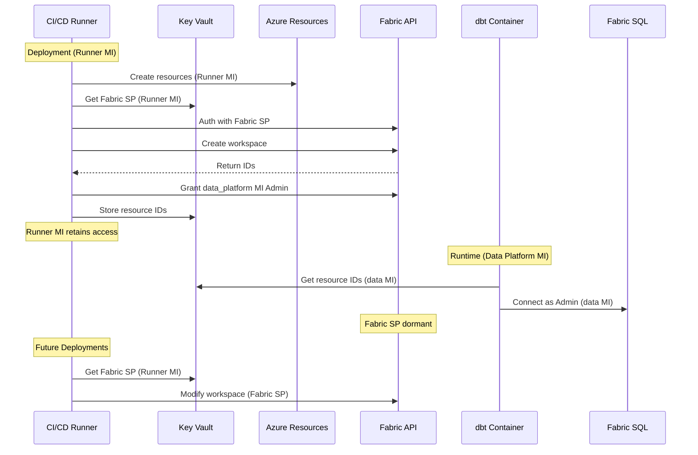

# **Customer Data Platform Design**

This document outlines how customers can build their data products using Airbyte, dbt and Airflow leveraging the standardized VibeOps platform foundation. 

## **1\. Design Principles**

The key design principles are

* **Medallion Architecture**: Landing, Bronze, Silver, Gold pattern with a single dbt project spanning all layers.  
* **Straight-Through Processing**: Each source has its own Cosmos DAG that runs Airbyte sync → Bronze → Silver → Gold in one flow, with dependencies managed by dbt.  
* **Separation of Concerns**:  
  * **Airbyte UI** → Connectors, streams, and extraction settings are configured interactively.  
  * **Developers** → Only configure YAML (schema, keys, partitions, schedule), write Silver/Gold models, and author custom macros.  
  * **Platform** → Manages Bronze models, merge logic, DAGs, and orchestration automatically via artifacts.  
* **Governance & Consistency**: Standardized schemas, naming, ETL control columns, and idempotent incremental processing. Schema drift not supported.  
* **Artifact-Based Deployment**: CI/CD generates dbt models and DAGs, publishes artifacts to blob storage, and Airflow executes directly from blob.

## **2\. Fabric Design**

### **Environment Structure**

* **One Workspace per environment** with single Lakehouse  
* **Lakehouse created by Terraform** during initial deployment  
* **Schemas created lazily** by dbt at runtime. 

### **Integration with CI/CD**

* CI generates dbt models, DAGs, and external table scripts pointing to schema-qualified objects (`bronze.orders`, `silver.customers`, etc.).  
* CD applies changes against the environment’s Lakehouse, ensuring all schemas remain consistent.  
* External table scripts for landing files (ADLS → OneLake) target the `bronze` schema by default.

### **Fabric Provisioning Process**

1. **Workspace Creation** \- Terraform used the Fabric SP credentials to creates workspace using Fabric REST API. Fabric SP (as workspace admin) grants Member role to `data_platform` MI  
2. **Capacity Assignment** \- Terraform assigns customer capacity to workspace  
3. **Lakehouse Creation** \- Terraform creates single Lakehouse via REST API  
4. **Schema Creation** \- dbt creates schemas on first model execution. 

### **Fabric Permission Model**

**Authentication Context**: Implements service principal and managed identity patterns from Authentication Design Sections 3-4.   
**Deployment**: Permissions configured during infrastructure deployment via Terraform and Fabric REST API.

Microsoft Fabric requires permissions at two distinct levels:

#### Azure Control Plane (RBAC)

- Managed by Azure Resource Manager  
- Controls workspace creation, capacity management  
- Set via Terraform role assignments

#### Fabric Data Plane (Workspace Roles)

- Managed within Fabric service  
- Controls data access, SQL endpoint usage  
- Set via Fabric REST API using service principal

### Permission Flow

**Deployment Phase (via CI/CD Runner MI):**

1. CI/CD Runner MI executes Terraform  
2. Terraform creates Azure resources using Runner MI's Contributor role  
3. Runner MI retrieves Fabric SP from Key Vault  
4. Fabric SP creates workspace via API  
5. Fabric SP assigns data\_platform MI as Workspace Admin  
6. Configuration stored in Key Vault

**Runtime Phase:**

- All operations use data\_platform MI  
- No service principal involvement

**Future Modifications:**

- Same CI/CD Runner MI process  
- No permission changes needed  
- Fabric SP remains dormant between deployments



**Role Mapping**

| Identity | Azure RBAC | Fabric Workspace Role | Purpose |
| :---- | :---- | :---- | :---- |
| CI/CD Runner MI | Contributor on RGs | None (temporary during deployment) |  During deployments  |
| Fabric SP | None required | Admin (via API)  | During deployments only |
| data\_platform MI | Reader on RGs | Admin | All runtime operations |

## **3\. Data Design**

### **Storage Locations**

**Storage Location:** Landing zone in ADLS, medallion layers in OneLake. Storage accounts defined in Infrastructure Design Section 4\.

**Landing Zone:**

- Storage Account: `{customer}-{env}-landing-st-001`  
- Container: `landing`  
- Path Pattern: `/landing/source-{source_name}/ingestion_date=YYYY-MM-DD/ingestion_hour=HH/`

**Bronze Layer (OneLake):**

- Lakehouse: `{customer}-{env}-data-platform`  
- Schema: `bronze`  
- Tables: `bronze_{source_name}_{table_name}`

### **Schema Organization in OneLake**

Schemas are created lazily at runtime when dbt models first execute. 

* **Bronze** → schema-per-source: `bronze_{source_name}`  
  * Example: `bronze_salesforce.accounts`, `bronze_shopify.orders`.  
* **Silver** → schema-per-domain, business-logic focused.  
  * Example: `silver_customer`, `silver_orders`.  
* **Gold** → schema-per-product/consumption, analytics-ready.  
  * Example: `gold_marketing`, `gold_finance`.  
* `test_results` \- Created lazily when first test with `store_failures: true` executes  
  * Contains failed test records for debugging  
  * Tables named: `{test_name}_{timestamp}`  
  * Cleaned up based on retention policy (default: 7 days  
* **Elementary** → Stores results of elementary. Created lazily by dbt when the elementary models are run for the first time. 

### **Table Format**

* All layers use **Delta Lake format** for ACID guarantees and incremental upserts.

### **Bronze Layer**

* Each table reflects the current state of the bronze.   
* Its mimics the **source structure** plus standardized ETL control columns:  
  * `_integration_key` (from natural keys defined in YAML).  
  * `_ingestion_timestamp`.  
  * `_update_timestamp`.  
  * `_job_run_id`.  
* **Schema Drift** → not supported; Airbyte/dbt jobs fail on schema changes.  
* Airbyte **does not detect hard deletes**. We do not support log based replication in the current release.   
* **Merge Strategy** → dbt incremental `merge` keyed on `_integration_key` for idempotency.

### **Silver Layer**

* Models defined by developers under `dbt/models/silver/`.  
* Data is **cleaned, conformed, and joined across sources**.  
* Consistent naming and typing enforced via macros.  
* Derived attributes (e.g., customer lifetime value, standard identifiers) introduced here.

### **Gold Layer**

* Models defined under `dbt/models/gold/`.  
* Data is **aggregated, denormalized, and optimized for BI/analytics**.  
* Domain-specific marts (finance, marketing, product) with agreed KPIs.  
* Only layer directly exposed to BI tools / business stakeholders.

### **Medallion Flow**

* **Straight-through orchestration**: Bronze → Silver → Gold.  
* Dependencies resolved by dbt’s internal DAG; no manual task wiring.  
* Executed within **Cosmos-generated Airflow DAGs**, per source.

## **4\. Architecture and Flow**

* **Single dbt Project:** One dbt project spans Bronze, Silver, and Gold. This guarantees a unified lineage graph, consistent macro usage, and a single dbt docs site.  
* **Cosmos Integration:** Cosmos bridges Airflow and dbt, embedding dbt tasks (dbt run, dbt test, dbt seed) inside Airflow DAGs.  
  * One DAG per source system, generated from YAML.  
  * DAGs are fully automated — no manual Airflow wiring.  
* **Unified Source Configuration (YAML):** Each source has a single YAML file under airbyte\_sources/ that drives dbt and Cosmos:  
  * **dbt config** → schema naming, keys, partitions.  
  * **Cosmos config** → DAG name, schedule.  
  * **Airbyte setup** → connection \+ streams still configured in the Airbyte **UI**, not in Git  
  * Onboarding \= configure in Airbyte UI \+ commit YAML file → Bronze \+ DAG generated automatically.  
* **Orchestration Strategy:** Each Cosmos DAG runs on its defined schedule.On execution, it orchestrates:  
  * **Airbyte sync** → incremental extract to ADLS landing.  
  * **dbt run** → starting from affected Bronze models.  
  * **dbt DAG flow** → straight-through Bronze → Silver → Gold (via dbt dependencies).

## **5\. Developer Workflow**

### **Source Onboarding Workflow**

Onboarding a new source requires two coordinated actions:

1. **Airbyte Configuration (UI/API)**  
   - Data engineer must configure the source system in Airbyte:  
     - Connector type and version (e.g., Salesforce, Shopify).  
     - Authentication/credentials.  
     - Streams and sync settings (incremental/full refresh, etc.).  
   - This ensures Airbyte can extract data from the source into the landing zone.  
2. **Repo Configuration (YAML \+ dbt)**  
   - The developer adds a corresponding YAML file under `airbyte_sources/`.  
   - This YAML encodes:  
     - Source name and schema mapping.  
     - Unique keys for incremental merges.  
     - Partitioning settings.  
     - DAG naming/orchestration metadata.  
   - From this YAML, CI/CD generates Bronze dbt models and Cosmos DAG definitions.

The Airbyte UI/API provides the **operational connector setup**, while the YAML in Git provides the **platform contract** that drives model generation, DAG orchestration, and dbt lineage. Both must be aligned for ingestion to work.

### **Customization Boundaries**

The data platform separates **platform-owned components** (delivered via artifacts) from **customer-authored components** (data products). This ensures consistency, protects core logic, and allows safe customization.

**Developers may change (customization points):**

- `airbyte_sources/*.yml` → onboard or update sources.  
- `dbt/models/silver/*` → user-authored Silver models.  
- `dbt/models/gold/*` → user-authored Gold models.  
- `dbt/macros/custom/*` → client-authored macros.

**Developers must not change (platform-owned):**

- `dbt/models/bronze/all_bronze.sql` → generic merge pattern (platform-provided).  
- `dbt/models/bronze/generated/*` → CI-generated per source, derived from YAML.  
- `dbt/macros/platform/*` → platform-provided macros.  
- `dbt/artifacts/*` → CI/CD-generated outputs (compiled SQL, manifest, catalog, DAGs).  
- Cosmos DAG files (`*_cosmos_dbt_dag.py`) → autogenerated by CI/CD.

## **6\. Client Repo Layout**

```
client-repo/
  data-platform/
    airbyte_sources/              # Inputs (1 YAML per Airbyte source)
      salesforce.yml
      shopify.yml
      ...

    dbt/
      models/
           bronze/                  # Entire folder is platform-generated (do not edit)
              all_bronze.sql
              salesforce_orders.sql
              shopify_customers.sql
        silver/                   # User-authored Silver models
        gold/                     # User-authored Gold models

      macros/                     # Platform + user macros
        platform/     		 # Platform-owned, provided/updated centrally
        custom/       		 # Client-authored, custom business logic

      tests/                  # Outputs of dbt compile/run (CI-generated)

      artifacts/                  # Outputs of dbt compile/run (CI-generated)
        compiled_sql/             # Expanded SQL for Bronze
        manifest.json             # dbt DAG + metadata
        catalog.json              # Schema snapshot of Bronze tables
        dags/                     # Autogenerated Airflow DAGs (Cosmos)
          cosmos_dbt_salesforce.py
          cosmos_dbt_shopify.py
```

## **7\. CI Process**

**Scope**: This section covers data platform-specific CI logic including Bronze model generation, dbt compilation, and DAG creation.  
**Pipeline Infrastructure**: For CI/CD runners, triggers, and branching strategy, see CICD Design Section 4\.  
**Authentication**: CI processes use `data_platform` managed identity per Authentication Design Section 6.4.

### **Trigger**

Runs on every PR that changes:

- `airbyte_sources/*.yml` (per-source configs driving dbt \+ DAG generation)  
- `models/silver/*` (business transformations)  
- `models/gold/*` (analytical models)

### **Steps**

#### 1\) Validation

- Validate YAML syntax for all source configs.  
- Validate source YAML configs \- Schema name matches pattern: bronze\_{source\_name}  
- Validate Silver models \- Schema names follow domain pattern: silver\_{domain}  
- Validate Gold models \- Schema names follow product pattern: gold\_{product}  
- Validate dbt project structure and dependencies (`dbt parse`, `dbt compile`).  
- Run lightweight dbt ops (e.g., `dbt run-operation` checks) to ensure models can compile.

#### 2\) dbt Autogeneration & Compilation

- **Bronze models** are generated from YAML and written under `dbt/models/bronze/generated/`.  
- **Bronze tests** are generated in `dbt/models/bronze/generated/schema.yml`:  
  - `_integration_key` uniqueness test  
  - `_ingestion_timestamp` not null test  
  - `_job_run_id` not null test  
  - Platform test macros applied (`test_bronze_integrity`, `test_watermark_progression`)  
- Compile the full project (Bronze/Silver/Gold) to produce:  
  - `compiled_sql/` (expanded SQL for all models)  
  - `manifest.json` (full DAG \+ metadata)  
  - `catalog.json` (schema snapshot of all models)  
  - `run_results.json` (test execution results when run)  
- Generate dbt docs artifacts for review (`target/index.html`, `target/catalog.json`).

#### 3\) External Table DDL Generation (Landing → OneLake)

- For each source YAML and its streams:  
  - Read the **Airbyte stream schemas** (from the exported `catalog.json` for the connection).  
  - **Generate idempotent T-SQL** to register landing files as external tables in OneLake/Fabric Warehouse:  
    - `CREATE EXTERNAL DATA SOURCE` (abfss path to ADLS landing; credential placeholder for MI/credential name).  
    - `CREATE EXTERNAL TABLE` per stream with full column list derived from the stream schema.  
      - `LOCATION` points to the root of the stream’s landing path  
        e.g., `/landing/source-shopify/orders/*/*/` (covers `ingestion_date/ingestion_hour` folders).  
      - Include ETL control columns if present in the files (or document they’re Bronze-only).  
    - Use `IF NOT EXISTS` guards so scripts are re-runnable.  
  - Emit **per-source** scripts:  
    - `sql/external_tables/{source}/00_create_external_datasource.sql`  
    - `sql/external_tables/{source}/tables/create_{stream}.sql`  
    - (Optional) `sql/external_tables/{source}/teardown/drop_{stream}.sql`  
- **Lint checks in CI:**  
  - Verify every stream has a schema in `catalog.json`.  
  - Validate expected landing path pattern exists (directory probe via build script, best-effort).  
  - **Note:** CI only **generates** these scripts; execution happens in CD.

#### 4\) DAG Generation

- The **automation program** consumes the YAML (`dag_name`, schedule) and generates **one Cosmos-compatible Airflow DAG per source** with a standard 4-step flow:  
  1. Airbyte sync  
  2. Bronze merge (dbt)  
  3. Silver transformations (dbt)  
  4. Gold models (dbt)  
- Output to `dags/{source_name}_cosmos_dbt_dag.py`.

### **Pull Request Integration**

On successful CI, the pipeline **commits the generated code back to the PR**, including:

- `dbt/models/bronze/generated/` (autogenerated Bronze models)  
- `compiled_sql/`, `manifest.json`, `catalog.json` (dbt compile outputs)  
- `dags/` (Cosmos Airflow DAGs per source)  
- `sql/external_tables/` (**new:** external table DDLs for landing → OneLake registration)

Reviewers can see developer-authored changes (YAML, Silver/Gold models, custom macros) **and** generated outputs side-by-side.

## **8\. CD Process**

**Scope**: This section covers data platform-specific deployment including OneLake external tables, dbt artifacts, and Cosmos DAGs.  
**Pipeline Infrastructure**: For deployment pipelines and artifact management, see CICD Design Section 4\.  
**Authentication**: CD processes use `data_platform` managed identity per Authentication Design Section 6.4.

### **Trigger**

- Runs on merges to `dev/main`.  
- Optional: can also be triggered manually for hotfixes.

### **Steps**

#### 1\) Artifact Retrieval

- Pulls generated artifacts from CI:  
  - `dbt/models/bronze/generated/`  
  - `compiled_sql/`, `manifest.json`, `catalog.json`  
  - `dags/{source}_cosmos_dbt_dag.py`  
  - `sql/external_tables/{source}/*` (DDL scripts)

#### 2\) Airflow DAG Deployment

- Push Cosmos-generated DAGs to the customer Airflow environment.  
- DAGs are versioned and placed under `${AIRFLOW_HOME}/dags/`.  
- Sanity check: `airflow dags list` to confirm DAGs are registered.

#### 3\) dbt Deployment

- Sync dbt project (Bronze, Silver, Gold models) to target environment.  
- Install dependencies (`dbt deps`).  
- Run smoke test compile (`dbt compile`) to validate environment setup.  
- dbt execution (full/partial runs) are left to Airflow DAGs — CD only deploys the project.

#### 4\) OneLake External Table Creation

- Execute generated T-SQL scripts against Fabric Warehouse / Lakehouse:  
  - `sql/external_tables/{source}/00_create_external_datasource.sql`  
  - `sql/external_tables/{source}/tables/create_{stream}.sql`  
- Order of execution is enforced:  
  1. Data source (once per source system)  
  2. Tables (per stream)  
- Scripts are idempotent (`IF NOT EXISTS`) → safe to rerun.

#### 5\) Validation & Smoke Tests

- Run post-deploy validations:  
  - Confirm external tables exist in OneLake (`sys.external_tables`).  
  - Confirm DAGs are visible in Airflow UI.  
  - Confirm dbt project compiles in target environment.  
- Optional: run a single end-to-end Bronze sync for one source in non-prod before promoting.

#### 6\) Promotion & Rollback

- Deployments follow standard promotion model (Dev → Test → Prod).  
- Rollback strategy:  
  - Airflow DAGs: revert DAG file to previous version.  
  - dbt: revert to prior manifest/catalog state.  
  - External tables: drop & recreate using prior schema (backed by versioned DDLs in Git).

### **Outputs**

- Running Airflow DAGs per source system.  
- dbt project deployed and ready for execution.  
- External tables in OneLake providing direct SQL access to landing files.  
- Validated integration across ingestion (Airbyte), transformation (dbt), orchestration (Airflow), and consumption (OneLake).

## **9\. Runtime Processing**

**Scope**: This section covers runtime execution after CI/CD deployment completes.  
**Orchestration**: For Airflow DAG patterns, see Airflow Design.  
**Authentication**: Runtime uses \`data\_platform\` managed identity per Authentication Design Section 3\.

### Triggering

- **Airflow DAGs** (Cosmos-generated) define scheduling and dependencies per source.  
- Typical flow:  
  - Airbyte source sync (raw files → ADLS `/landing/source-{source_name}`).  
  - dbt Bronze merge (landing external tables → managed Bronze tables).  
  - dbt Silver transformations (business rules, conforming).  
  - dbt Gold models (analytics / consumption layer).  
- DAGs run on schedule (e.g., cron in YAML config) or on-demand.

### 2\) Landing Zone → External Tables

- Airbyte writes **raw Parquet/JSON files** to ADLS landing paths partitioned by ingestion date/hour.  
  Example: `/landing/source-shopify/orders/ingestion_date=2025-09-06/ingestion_hour=04/…`  
- External tables in OneLake/Fabric (created during CD) point directly to these folders.  
- Benefit: users can query raw landing data **without waiting for dbt merges**.

### 3\) Observability

- **Airflow** tracks task status (success, fail, retries).  
- **dbt artifacts** (manifest.json, run results) provide lineage and model status.  
- **External table smoke checks** (runtime validation queries) confirm new partitions are visible.

### 4\) Error Handling & Recovery

- **Airbyte**: sync retries and failure alerts; raw data is always persisted to landing.  
- **dbt**: failed merges don’t overwrite prior tables; safe rollback to last good state.  
- **Airflow**: handles retries, backfills, and catch-up runs if schedule is delayed.  
- **External tables**: idempotent definitions → safe even if re-executed.

## **10\. dbt Documentation Generation**

dbt provides an auto-generated documentation site (`dbt docs`) that consolidates model definitions, schema lineage, column-level metadata, and test results. This site enables developers and business stakeholders to understand data flows across Bronze, Silver, and Gold layers.

### **Design Principles**

- **Single Unified Site**: One dbt project spans Bronze, Silver, and Gold, producing a single dbt docs site with end-to-end visibility.  
- **Artifact-Backed**: Documentation is generated from the same artifacts produced in CI/CD (`manifest.json`, `catalog.json`, compiled SQL), ensuring exact alignment with the deployed models.  
- **Blob Storage Hosted**: The static site (HTML, CSS, JS) is deployed to a secured Azure Blob static site endpoint for access.  
- **Metadata-Driven**:  
  - Bronze: structure is generated from source configs.  
  - Silver/Gold: column descriptions, tests, and lineage are defined in `schema.yml` files authored by developers.  
  - All metadata is surfaced automatically in the docs site.

### **Workflow**

1. Documentation is generated during CI (`dbt docs generate`) alongside other dbt artifacts.  
2. On deployment, the static documentation site is published to Azure Blob Storage configured for static hosting.

[image1]: <data:image/png;base64,iVBORw0KGgoAAAANSUhEUgAAAoEAAAGlCAYAAACFhiwFAABXeklEQVR4Xu2dCZhcRdW/hyCgfOAGggKfPMIIODCTzHRPJiEiI4KICAFxEGQREBSQVSQsYgiLEHYBWfKxJMiaVcR8+QcQ84FBIJKQRAIkIWxRIKBIJkFBlvuvc6dOU326e6Yn3XNmus7vfZ7fU7fq1q3bfae66517J1BXBwAAAAAAAAAAAAAAAAAAAAAAAAAAAAAAAFBFFix49b+WzFuVuLyHUFbfJK9RrbLkic6fFr4/q+n84Ok/r2qX16iaLMHnKJen576ZkdenmrhznCXPaTXPzl/1kLw+1cSd4yp5TsNJnvvL6k3lNYqFJXML3q/ZPDN35UHy+kTJ0gVvrf7735ME+TDyGtUqr/z1vYL3ZjkvLnm7z3627kuj4HyW88LT/35bXqNqsXT+W82vrfig4JyWs3juquPkdaoWf3+98HyW8+zCt1bJaxQDS55Y/Zx8r5bz1+fe6bP1YkDx4uK335Vv3nrkNapV5PuynleWv9tnP9tnF65eKc9nOX978T99dq0Xz+08Sp7PepbMXzVNXqdqIc9lPS8923e/TPYn+EU2P6+9+kHy+OPJOvI6RQcksDDyGtUq8n1ZDyRQL5BA3UAC9QIJtBFIoOHIa1SryPdlPZBAvUACdQMJ1Ask0EYggYYjr1GtIt+X9UAC9QIJ1A0kUC+QQBuBBBqOvEa1inxf1gMJ1AskUDeQQL1AAm0EEmg48hrVKvJ9WQ8kUC+QQN0seWLVvfI6VQt5LuuBBNoIJNBw5DWqVeT7sh5IoF4ggbqBBOoFEmgjkEDDkdeoVpHvy3oggXqBBOoGEqgXSKCNQAINR16jWkW+L+uBBOoFEqgbSKBeIIE2Agk0HHmNahX5vqwHEqgXSKBuIIF6gQTaCCSwh8yaNS+5+OJr0u3ly9/K2/fss2/ktp966pXkoot+lbz+etf/5unOO6cnDz64oGA8GuOmmyYlv/3trIJ92pHXqFaR76vSvPTS6rScMePh3M+zp1DfYtulcuCBhxW0VSsDQQLpcyPb1jQD6TMjUysSOHv2k+m8pPzlL38t2N/dfLznnv8raJN5+ulXc9u33fbb9HxcX7DgpYL+a5qBKIHXXXdr+n67u4YytKYUWx96myVL/l7QVq1AArsPf56Kfd8fe+xPCtrC3HvvowVtYa6//ra8z83MmY8kf/rTU7l6sXOuaSCB3WTy5HuTXXbZPbn66vFp/cEH5+ft33bbhrRcseK9ZIMNNky/DG699e607ZBDjkq/FNyp846hH+To0WOT3XffKzduf0Veo1pFvq9K84c/zE3LjTfepGBfqdQFP+dwu1S4z5577pu3gFYjA0EC68q4BuVmIH1mZGpFAkeMaE9OOumMNMWkrq6bn9dmm21R0BZm6tT7ky233CpXP/TQHyYHHXREsvXW26T10047p+CYNc1AlMCjjjo+vQZ14hqW+mxTP5rHBxzw/YJ9xSLHDXP22RcVtFUrkMDSefXV9Ds295mS+3taO9gdioXGHTVqTNLU1JKr77ff99I6eQa3yePWNJDAblInLnQogTQJhg3bqWg/CosE5YYb7sxthza///6HpIbP9T32GJlcc80t6Xg8pqzz+SjPPLMi+d3vHizYX2742tQ68n1VGvrZ1YnrTR8+uhMVfnjp7hRv02/kTz75t3T7jjt+l/uZ8Dhc7rPP/uldsrCdP+zVSn9LIM3pkSM70pJ+MaoLrgWF+9E2yQl9Ye666x7pnRG6zmEfivzMvPjiqtxYr732ftLc3Jpm1Kizk1NOOSu377nn3syNddll1ycXXnhVbh+9NvpFjY7jPryPXs9xx52abre1jSh4f2FqSQJffvmdNFSn6xxeaypJ2sI6zUu6TmEbzX9eiDjUHrbxdx8fF6sE0vd1nZ8zLIHbb99UcA1POOG03DEky/IuEM23nXbaJe84aqPyrrtmpGU2Oyy3j0LznsblsfkY6s91/s6itYq2exITGUhg6bAE0ueJbgKRjFOdQj8b/vlReJ2gNvr80C9V1M7fT1Qn6eOxqS38Re3gg3+Q2+ZfrKiPfE1rGkhgN6kTFzqUQLrLx4+DZT9KKIF0F4O3aUGj/nxMMQnkOj1SlnW6M0mPxyg0IUgCX3757YLzl5P8K1S7yPdVacLFkX52fL2pjWSPvgDoLrE8joTikkuuzdXDuwNcSgmkL/didwsqSX9LoOuWLFv2zzwxoDb+4gzbSE7OPfeyXJ2v9c03T871k5+ZsN+RRx5XMCaVjzzydJ7UhBLIn5fwOPpc3XDDXbmfM/0sw8W7VGpJAknMKdxGC01dcE2p/PnPL8yrh9vHHHNywbgUuksRfh5ooaMF77DDjk7rsUpgnb8u8k4gXUN678U+29yHw7/Q0DZdx7CPLCn0pyp0rfmOuJyjJJ3yO4s+d/ffPyevXzmBBJYOf5fR54lv8tDPhn6ZpZ9NKNzUj0r+nuM2Ct84CEPfT/TdecUV/1NwHH9+ecxqBBLYTerEhQ4lMFzgwkchHJZA+jvBUNL4rgaJwKOPPpPcd99juX1SAuk3CFmn3zTD85AEhvXeRF6jWkW+r0pDX+hUHn74MekdIbm/zn+Au2svVRaTwD//eWnBWJWkPyWQ/lalzl8HCrWRfPHfVlIbfYHyNsnJ/Pkv5upyPIr8zBTrx1+8vI/uiNDnkuuhBPIx4TZ9rh56aGHBuMXOFaaWJDCs1/n3JR8v3XLLtLx6uB3+gsMh4aD9FL5LHv4CTLEmgXQN6e5Nsc82ySGJAtfpaQ4/bqdfPMJxZUnCuHjxa+n2+edfkZZSAukXH/mdxZ+33gYSWDryF1r6HNHP5oorbkh/NsUkkL/nuI3S3c+GjwvPU6yt0kACuwkJFv1wd9ttz/RDHUrg9Ol/zG3T7WB3ivRRFZXUFt4ODscMH23RPrp1TB9c+g2uHAmk3zbouOOPH5VOIEhg77+8e0r4OIt/tqeeOjpPVqSMU8aMuTjXTn3oC59KumNMJf2mTyVLID1CoLu7NMfozpUcb03TnxLouuQWvgkTpubuRtDf81GOPvqk3J1WSiiBl18+Lv0ckCiHY8rPDD02ps8XSTq30cJKj25p4aU/06C2hQuX585BpZRAGoP+nofK8HNFP8P29t3SO1/y0adMLUsgzWkquc6PwLke9uWSfn7F9oXbliSQH+OyBNI/CKCSfunhzzbf4QuP4+8Crp9++rkF155L+kzQvKRt+mzQXKc711QvJoF8LH9ndSca3QUSWDpSAum608+G2uhnQ98p1EY/f37UKyWQbgBRSX9DG35GqC2cHzwO1Y844thcH/4zGPnaehtIoOHIa1SryPfVl6Ev97rgwz8Q058SaC21IoGxZCBJYOyBBA6s0KNj9/Krvv5AAg1HXqNaRb6vvgw9jnz++ZUF7QMpkEC9QAJ1AwnUCyTQRiCBhiOvUa0i35f1QAL1AgnUDSRQL5BAG4EEGo68RrWKfF/WAwnUCyRQN5BAvUACbQQSaDjyGtUq8n1ZDyRQL5BA3UAC9QIJtBFIoOHIa1SryPdlPZBAvUACdQMJ1Ask0EYggYYjr1GtIt+X9UAC9QIJ1A0kUC+QQBuBBBqOvEa1inxf1gMJ1AskUDeQQL1AAm0EEmg48hrVKvJ9WQ8kUC+QQN0snb/qNnmdqoU8l/VAAm0EEmg48hrVKvJ9WQ8kUC+QQN1AAvUCCbQRSKDhyGtUq8j3ZT2QQL1AAnWzZP6qafI6VQt5LuuBBNqIGQlcOn/1avnmrUdeo1rl5eVr9v/GjDUvPPPv/8hrVC3wBZqf5xf96y15jarFU0+s/OKKV94vOKflLJn35n7yOlWL11Z8UHA+y1m6YPVqeY1iYOkTq56U79Vyli97JxoXKIvnn/jnJ/szS+auHi/b+iPyutQ6Sx/9x8fle9TOkic6O2WbdiZNStaW16YvkOfVDsmobOuPyOvSF8hzamfxvM4Llj6x+j7Zrh15XfoCec7+yECY2/K6xMbLjyfry/esHfo5P/34G42yXTvy2oA+Zsm81RNkG4iDJfM6V8o20DfQF6hsA33D4sdXjl46b/UM2Q76BsxtG9DP+al5/9xStoPIgQTGCyRQDyyUekACdcHctgEk0CiQwHiBBOqBhVIPSKAumNs2gARWibun7Ti5ljJzxg9fkG0DPZMmZXeT1x0UAgnUAwulHpBAXTC3bQAJrBLJW1MTpG8zZUq2WV53UAgkUA8slHpAAnXB3LYBJLBKSGFBqh9IYHlAAvXAQqkHJFAXzG0bQAKrhBQWpPqBBJYHJFAPLJR6QAJ1wdy2ASSwSkhhQaofSGB5QAL1wEKpByRQF8xtG0ACq4QUFqT6gQSWByRQDyyUekACdcHctgEksEpIYeFMn3pmsuCxywvaS+Wwg79a0KYZer2zZp5b0F7NzH/0stz2sievTcuHH7ggLV97cXxBfw4ksDwggXpgodQDEqgL5rYNIIFVQgoL56jDd0vFbpPPfKJgX7HQULKtmtl377aCNgqfl0p6vX35Onjsd/45MXdduG23XQYX9OdAAssDEqgHFko9IIG6YG7bABJYJaSwcOY+fElaknzdOeHkpGmHLVPhoby/akpaDhu6TZ6EUbnTiC+lgsR1lqWtvrBp8telN6TtPNY2X9ws2XCDj+WOpz7cn9q5H++n84Wv8azTvpP86vIj884vzxuOz6/r2b9ck7bz++H93Pbuykm5/uH5qO23k05Ptth8o4LzUR6897y8/hxIYHlAAvXAQqkHJFAXzG0bQAKrhBQWDkvgqSeNTMaed3AqO2+9fkdy9WVHJscdvUdOfuju2/hxxxVI0Q3XHJMcf8w3C9ovOv+QvDqXd93yk3R82e/oI3dPSymAfCw/jqVtynVX/jCtF5NALkkCd991SK5O74/eE52f+rMEyvP9+sYTcueRdwIp++0zrOAYCiSwPCCBemCh1AMSqAvmtg0ggVVCCguHJZC6vP3GXTmZ4lA7lSRP464+Ok+yqDz9lH1TgSPhas3UJ/feMzptLyWBC+fk//0h9xvzs++mZSkJXLLgV7ntVStuLxi3HAkk0b32l13ySCEJpLt94blWvnpb7nXQ3cDf3HVa3riUvb6ZzTuGAwksD0igHlgo9YAE6oK5bQNIYJWQwsLhR6fnnHVATnaoLZQq2kcl10d+a2i6/5ADd07r73VOLhClUhJIJf0dIj0CDvuxBNI//KA7i08/cVVurO8f1J5Muf3UvHH4bwepvuc3MkXPIyWQy9FndKRlMQkk0aWSHmlTSe/tg9Vdj8W5Dz02D4/hQALLY8lcSKAWWCj1gATqgrltA0hglZDCUm7oUNlWLLN//4uy+65J+nLs3iS8kygDCSwPSKAeWCj1gATqgrltA0hglZDCUm7oLptsKxa6k0d31mR7tdKXY/cm9PeCso0DCSwPSKAeWCj1gATqgrltA0hglZDCglQ/kMDygATqgYVSD0igLpjbNoAEVgkpLEj1AwksD0igHlgo9YAE6oK5bQNIYJWQwoJUP5DA8oAE6oGFUg9IoC6Y2zaABFYJKSxI9QMJLA9IoB5YKPWABOqCuW0DSGCVmDKlbWUtZdrUnf4j2wZ+IIHlAAnUAwulHpBAXTC3bQAJNMqSeasnyDYQB5BAPbBQ6gEJ1AVz2waQQKNAAuMFEqgHFko9IIG6YG7bABJoFEhgvEAC9cBCqQckUBfMbRtAAo0CCYwXSKAeWCj1gATqgrltA0igUSCB8QIJ1AMLpR6QQF0wt20ACTQKJDBeIIF6YKHUAxKoC+a2DSCBRoEExgskUA8slHpAAnXB3LYBJNAokMB4gQTqgYVSD0igLpjbNoAEGgUSGC+QQD2wUOoBCdQFc9sGkECjQALjBRKoBxZKPSCBumBu2wASaBRLEpjJZBKfa+W+nqivr19Ptg1k3Hvs5Pcr91WThoaGDah057mdyubm5sFu+6HW1tbPunK7/N7xgoVSD0igLpjbNoAEGsWKBDohWR7WOzo61m5paWnidhJDl2m0nc1md3Xby5zQfM3vI5l6iI+lfS7jue7bxrrxrnblovb29o+6crar/5j2ufJyV7/P91uHzulytK/P9OUZXHf957js4rZPpL7udaQfTBqT+1Ob257rZGtHqjMZL32u7PR3Age57UaX6UGfu934v3bvcyiN6dvovAe75BZX1zYx498ntfvrlV6joA+fj67RniyBvm1F2DdmsFDqAQnUBXPbBpBAoxiSwLwvMidqH3ESdGtdlyTNdTmRpI/6ufYDwmNc+UhbW9umQRsd85MPR0vbZzU2Nn6K7hhSH+rvygU0livvDvrxmItFfWJY99upuNGYJJI0ppO+7f2YaT/XXs/9/TE5CZxw3d3/ynwoueG4JGwrMl2SeQadm9rc2Du78m6Xo6nuRfQnmS7ppetyqyvX4XFcfQ8e15X3ufo9oQS6+jjuGztYKPWABOqCuW0DSKBRLEugK9bifWH8Ha/co9SMkECOk5wdeDxXnxVsh+OlguWFM/c6+A5ecI48CcyIR6lFxjw24+/iMU1NTZsEx3f+6tJb/h3UCyTQb6/vspj3011Qf0cz75r4/en1Csah13GKl0EaJwkl0I1zVNg/ZrBQ6gEJ1AVz2waQQKNYkUC6e+YykradpIz1EphC8kJ3vcI6l9TP7bvTHXtguE+SERJIj5tZHAk3xjDe58tFol4ga+6co6gcMmTIJ+kRMY3J+5xsZTNdj5bzXk8wTvo42I2xt9veOOPvCNIjX+qT8RLoH13nJJCuA0vg4MGDN5fjhsjXTKW4E5i+fgtgodQDEqgL5rYNIIFGsSKBBIkPiYqTk+ZQAoN99I8ptnMZ6/vt58q7Gxoa1vX1kfy4l/qL4x8ItluoD4mbr9O4LGH1ft+v/b5z/f70b+1oH49Dx/vz5h5P83561ErHOelq4P7cx5f8N4FpGz2q5rH8OOnr8e8nvBPYThIYvk8+9sOzdBGca5Yv6e8g6S4q/01g3p3KmMFCqQckUBfMbRtAAo1iSQKNMIg3+vM/ETNixIgNnQQeKdtjBQulHpBAXTC3bQAJNAokMF76UwKtgYVSD0igLpjbNoAEGgUSGC+QwL6h2KNxLJR6QAJ1wdy2ASTQKJDAeIEE9g3+byXp7yvHcBsWSj0ggbpgbtsAEmgUkkBe1BAEWbNgodQDEqgL5rYNIIFGwZ3AeMGdwL5BCiC1YaHUAxKoC+a2DSCBRoEExgsksG8g8QsfBRNYKPWABOqCuW0DSKBRIIHxAgnUAwulHpBAXTC3bQAJNAokMF4ggXpgodQDEqgL5rYNIIFGgQTGCyRQDyyUekACdcHctgEk0CiQwHiBBOqBhVIPSKAumNs2gAQaBRIYL5BAPbBQ6gEJ1AVz2waQQKNAAuMFEqgHFko9IIG6YG7bABJoFEhgvEAC9cBCqQckUBfMbRtAAo0CCYwXSKAeWCj1gATqgrltA0igUaopgZlMZv2WlpaD6+vr15P7StHa2rq9y46UwYMHby73u/Fukm2MO1+bbAtxx+6bzWYPoG03/s5ue0RDQ8O6sh/jxtvTHfNd2V5N3Dk+wdvu9WxFJb13X/4376sGkEA9sFDqAQnUBXPbBpBAo1RLAp08fctJza607USnUe4n+H+xJdpmybaQYseUg3ste4R1HseVX3ay9dkS+3Ll0KFDNwr7VAs39sxgO++89Lrc676H91cKJFAPLJR6QAJ1wdy2ASTQKNWSwGKy5toWULvfN8hvPyL6zKK7c3yHjvuHguSyQtTnOumsD9tcfY4rZ/O4TU1N/+Xafsx17utYy21vx+0E9wvH6+joWJvO6+ud3F7ktfRUX0bbDLU50dubt8NSblcKJFAPLJR6QAJ1wdy2ASTQKH0hgbTd1ta2qZcgzsRigpMRdwKdII3kY/z+tHSidmpYD7cbGxs/xW0hQuT4dUwP+zhZ3IQfy/r9R5Ng+nqBBPZUctyYO/BxIUGf2S530yNgPp73h/0rARKoBxZKPSCBumBu2wASaJQqSuDiYHu5l8A8CSomOBkhgaFQhaWTqivCuuhT9PGzZ1Bzc/Nmxc5NkCgOGTLki7QtzxmU5UrgMVQyrr48rLtr8nHXttjlETrGZR8nnGeHr63U61wTIIF6YKHUAxKoC+a2DSCBRqmWBBJecEhuJvh6C9XpUS3VnYxtSXUSxOCYB3ibcH1nuLZOl/OCOt1Z+5HvXyBMrpzkz3N2sG9r/1ryBK4Y7rgzqeQ+fHfOZVqxMUqVLHQuV/p2+Sj4Kv5bRbrj6dvSO4NBn5Kvs7dAAvXAQqkHJFAXzG0bQAKNUk0JrFWqKV6V4F5HYzX/dTIkUA8slHpAAnXB3LYBJNAokMB4gQTqgYVSD0igLpjbNoAEGgUSGC+QQD2wUOoBCdQFc9sGkECjQALjgP+2MJvNjuE2SKAeWCj1gATqgrltA0igUUgCnTiMQ2o7LIGhDEIC9cBCqQckUBfMbRtAAo2CO4FxEAogt0EC9cBCqQckUBfMbRtAAo0CCYwDf/evPWyDBOqBhVIPSKAumNs2gAQaBRIYL5BAPbBQ6gEJ1AVz2waQQKNAAuMFEqgHFko9IIG6YG7bABJoFEhgvEAC9cBCqQckUBfMbRtAAo0CCYwXSKAeWCj1gATqgrltA0igUSCB8QIJ1AMLpR6QQF0wt20ACTQKJDBeIIF6YKHUAxKoC+a2DSCBRoEExgskUA8slHpAAnXB3LYBJNAokMB4gQTqgYVSD0igLpjbNoAEGgUSGC/lSGBLS8swKrPZ7KEuo+T+UmQymStdTqPtwYMHb+7bii4Wrv2s4P9oMrPI/qLHEd3tI8L/S0p4Htmvr8FCqQckUBfMbRtAAo0CCYwXkkAnRMewrBXD7VtMZW8lkHHHn+tE8tt+u+hiQXIm20JKHVcO7tx78Tafp729/SNu++cf9up7sFDqAQnUBXPbBpBAo0AC48VLYO7OmBOmGS71tB3cPctJoNte5MqtQikjMXTHnO3a7nOZ5eoHuHKsy6Vue49iEujK2Xy8r+fdoWtubs66YlDQn8tFXO/o6FjbleuIPoPcOXftGrULandtV/jtVAJd2ehyYtivr8FCqQckUBfMbRtAAo0CCYyXqy+Z8G8naBc5IZruROk7PUkg3wnkfQzVw/i2khKYFf8PY5azoL6xGCst/R289cPz8za9D26TuH130vui8/hx0/ekCRZKPSCBumBu2wASaBRIYLyQENHf/FFo28nZOCl6gbh1J4Ezm5qa/quhoWFdN9Yc35ZKoKv/kMYNjytDAvncc8M6i154fvk6XdnI+5j6+vr1XPtp8jyaYKHUAxKoC+a2DSCBRoEExst3vn3ge7ztJWotKl06A6laRNtOwA52OTXom2PIkCGf5O3m5ubNqHSidzFJIG37MS/l41yfr3B/wo17Zlinu5LUt7W1dUeq++PpNaQLe3h+3s52PYamfvfxPt7PfeR5NMFCqQckUBfMbRtAAo0CCYyXcv51MKgOWCj1gATqgrltA0igUSCB8QIJ1AMLpR6QQF0wt20ACTQKJDBeIIF6YKHUAxKoC+a2DSCBRoEExgskUA8slH1H+HefBCRQF8xtG0ACjUISyF+yCIIgAz3X/vL2myGBekACbQAJNAruBMYL7gTqgYWy7wgFkP7zQ7gTqAvmtg0ggUaBBMYLJFAPLJR9h5O/WWEdEqgL5rYNIIFGgQTGCyRQDyyUekACdcHctgEk0CiQwHiBBOqBhVIPSKAumNs2gAQaBRIYL5BAPbBQ6gEJ1AVz2waQQKNAAuMFEqgHFko9IIG6YG7bABJoFEhgvEAC9cBCqQckUBfMbRtAAo0CCYwXSKAeWCj1gATqgrltA0igUSCB8QIJ1AMLpR6QQF0wt20ACTQKJDBeIIF6YKHUAxKoC+a2DSCBRoEExouUwGw225zJZI5taGhYN2zvD9zruEy21TJYKPWABOqCuW0DSKBRIIHxEkqgk67Frlgr2F02Th53lW2V4l7PCtlWy2Ch1AMSqAvmtg0ggUaBBMaLkMC8L/Lm5uavkIhxO/+/WZuamjZpaWkZ5raXBfsWuzziZHBbVy7gvm7XIB4vHIfLjo6OtX3fB9yxP/LtdM5FVHK/9vb2j1DpzjuH21weCsbq9OH6/1Df8Fw+/SaWWCj1gATqgrltA0igUSCB8VKGBN7u96WC5dPJ/fmY8E5g0I8yMWh/pLW1dXsnZ2e67atcFrvtpvA4Kl3bl3ydZLCzra3t47zfZXbYl6Bz0zjh6wn30xjB6+m3xQoLpR6QQF0wt20ACTQKJDBeepJAJ1jj/L4F4T5Xv8+X21EpJDCVRIkTwM+GkubErZ7uKvL+YN/nfbnCi2judbljDnPFoKBtLdenITg2J6h+f/raXRq53l9godQDEqgL5rYNIIFGgQTGi/yHISRPPqNdvuxyndxHj2aHDBnySdp28neEK48P9pNwtdA2P7oNYTkT8pc+VqZHw1Rva2vbwrcv9+Xn/NjLM+IuZNBnLNXd69mP6iycQf+Jvn4G1fsDLJR6QAJ1wdy2ASTQKJDAeJESWCuQ0Mm2gQ4WSj0ggbpgbtsAEmgUSGC81KoE1iJYKPWABOqCuW0DSKBRIIHxAgnUAwulHpBAXTC3bQAJNAokMF4ggXpgoew7+G9Es9nsGKpDAnXB3LYBJNAoJIHuy/WeAZJbBkLcgnNlrcS93jGlcv7oX74t25DsGHkNq5GfjbqQRKWgvRrJFpmjAzjyM11xMh/+Q6E0kEBdIIE2gAQaBXcC4wV3AvXAQtl3BAI4i+qQQF0wt20ACTQKJDBeIIF6YKHsO0gAs9lsO9chgbpgbtsAEmgUSGC8QAL1wEKpByRQF8xtG0ACjQIJjBdIoB5YKPWABOqCuW0DSKBRIIHxAgnUAwulHpBAXTC3bQAJNAokMF4ggXpgodQDEqgL5rYNIIFGgQTGCyRQDyyUekACdcHctgEk0CiQwHiBBOqBhVIPSKAumNs2gAQaBRIYL5BAPbBQ6gEJ1AVz2waQQKNAAuMFEqgHFko9IIG6YG7bABJoFEhgvFRDAoP/W8NcuY9obGz8lGzrDTQ2lz4TRJeaAAulHpBAXTC3bQAJNAokMF6qJYG+XNTS0nJSqf1rSiiBVPr/V+y0/F4DHyyUekACdcHctgEk0CiQwHiplgQ6MdvP36XbmMq2trZNXbnAtR8QSmAgdBPDOuEE8k7f1sltvp4ngbzN9fr6+vW4fSCDhVIPSKAumNs2gAQaBRIYL9WSQJcOJ3zjgjpnopQ3XxaTwGGyLazLceTYAx0slHpAAnXB3LYBJNAokMB4qZYE+nKuy8+p3tHRsTbdDQz3i74FYleuBFJJdx5dhvr6srD/QAULpR6QQF0wt20ACTQKJDBeqimBvO3SQqWTujnU5mRt10DgznXpzPi/6eutBPpjG319ErUNHz7802H/gQoWSj0ggbpgbtsAEmgUSGC8VEMCQXlgodQDEqgL5rYNIIFGgQTGCyRQDyyUekACdcHctgEk0CjFJFA+sgO1CSRQDyyUekACdcHctgEk0CihBGaz2TH+b7PwoY8ASKAeWCj1gATqgrltA0igUUgCWfzC0D65zceU2u8ksj3cz1Lp22ZRgr5jRN/2UuNSGW77scLzjgm228OxxGugcXOvIR002JbnVXw/Jc/r30/uvH47d95wOx002Jbjyv2ir8o1LbI/PO8scd7cNpW1cE3pWHHeMeG2uI657TLGLfl+qBQ/k5Jzs69eg+Y1Peaok2dBAvWABNoAEmiU8E4gfxmHX8SgdsGdQD2wUOqBO4G6YG7bABJolGJ/E8h3DkBtAwnUAwulHpBAXTC3bQAJNEoxCQRxAAnUAwulHpBAXTC3bQAJNAokMF4ggXpgodQDEqgL5rYNIIFGgQTGCyRQDyyUekACdcHctgEk0CiQwHiBBOqBhVIPSKAumNs2gAQaBRIYL5BAPbBQ6gEJ1AVz2waQQKNAAuMFEqgHFko9IIG6YG7bABJoFEhgvEAC9cBCqQckUBfMbRtAAo0CCYwXSKAeWCj1gATqgrltA0igUSCBA5dMJvP1lpaWfWV7uZSSQDfueNlWCeWM197e/hH3Xq6W7b1l+PDhn+ZtGpPK1tbWHT/s0UVbW9umsi2bzf5CtoU0NzdvJtvKBQulHpBAXTC3bQAJNAokcODR0dGxdiX/6z4+thsJLBjbtZ3rJO3bsr0cio1HFPv/wFZK8P+QfcjlmrAtpETbYtlWLbBQ6gEJ1AVz2waQQKNAAgcedMcsm83+LGyju15OYjpdVgQlC1He//PZbz8SSuDgwYM398el/dz4o4JjBvnxlvnjZ4bjS/xxc8Pz+ZLGT89Bd9V8v0f8a6ft5UOHDv2C36bX8CNXzqJzufc8w5Xj+XiOG3YteW4uw+2wj39vNM76fv9il9ni2GW+XESlvz7h/gVy3O7AQqkHJFAXzG0bQAKNAgkceDj5uM9lH789zeVK/+gzFSInTE1eVKSEnePSwfVQAkOh8dtr8RhuvJMywZ1At71xOL6E253oDQ7rpV5XuC3bXGa5477k6+N9+Xnu487xNd5ubW3d3l2Hj7r+c1yf04uNyfX6+vr1qHRCuIfLrb49vRMoj+PH1K6+QOw/h8pywEKpByRQF8xtG0ACjQIJHHg4adkvFJvMhxLIdZaUzrDuZObsTJkSSMc6wfqMK48MJPCwsK8rb+djQni/e53fCeulXlexPryd6boTmEpfpgcJdO0X+pLHWhTW/fZpflwW3F1c+YDf1ysJpOtJZTlgodQDEqgL5rYNIIFGgQQOTJqamjZhkWlra/u4kMCx1O5l8e5AakaTmDlx2pLa5sx6IZUxDz3ypfHSx6IujVS6vl8Jjqf2S2kM2i72Dy4I34+SSqKTpaN8e+51UZ1fB/0jDT6H70ePYjv93z4+4PZv4ce5iUqu+75fDbbTMdzr2plKFkQxdm6b+vlzpHcN6Zxhn6C8ypfyTuDorpF6BgulHpBAXTC3bQAJNAokMF5K/cOQ3uBE6HYvUGmc4O0QihboAgulHpBAXTC3bQAJNAokMF6qIYGgPLBQ6gEJ1AVz2waQQKNAAuMFEqgHFko9IIG6YG7bABJoFEhgvEAC9cBC2XcEf4owhuqQQF0wt20ACTQKSaD7gl2OxJfddv3G+7IN6Zu4a02iUtCOVCW5v0mlXPvL22+GBOoBCbQBJNAouBMYL7gTqAcWyr4jEMBZVMedQF0wt20ACTQKJDBeIIF6YKHsO0gAs9lsO9chgbpgbtsAEmgUSGC8QAL1wEKpByRQF8xtG0ACjQIJjBdIoB5YKPWABOqCuW0DSKBRIIHxAgnUAwulHpBAXTC3bQAJNAokMF4ggXpgodQDEqgL5rYNIIFGgQTGCyRQDyyUekACdcHctgEk0CiQwHiBBOqBhVIPSKAumNs2gAQaBRIYL5BAPbBQ6gEJ1AVz2waQQKNAAuMFEqgHFko9IIG6YG7bABJolP6UQP4/Acj2WsK9/mm+zP1vrWSf/gISqAcWSj0ggbpgbtsAEmiU/pJAJ0sXivojYb1WCCWQypaWli9ls9nj8nv1D5BAPbBQ6gEJ1AVz2waQQKP0lwQ2NDSs6/93UM1UDyXQbXf6Mv3y4dL1Hem2F7S2tn5W3nHjent7+0fc9oluc5C/M3cktTs528ttH+0y22Vj2ufaZrjU8/EuZ1FZX1+/njvXFW1tbR+X49P5uc3X8ySQt8Pzcrs2kEA9sFDqAQnUBXPbBpBAo/SXBBIjRozYMJCrnAQ6ATvUtyUdHR1ru/J2X+/0glXw2JXr7tgjRB+Wwc/547fm/sUk0NWPCsfzY27bzXmLSmBdcN5cZ2UggXpgodQDEqgL5rYNIIFG6S8JpDt2VDrputyXd/I+J06zfcliN87XL3Tb9/jtz3P/sG9bW9umbqxdgl1r8X46lzv+F3Snj+o0rsuo5ubmBi9sZ7n6gb7/3GCMvPFFe54EunK8f2258wbdVYEE6oGFUg9IoC6Y2zaABBqlvyTQCdk3vHgtpnrweJge+ZJI0b7taJ8rr+Pj3PZEv+8MbvPt4Z24FXy8O88wP+4Vft9DVB8yZMgnXXUt2nZ9LvLlma7fAeGYPK4rW3yfObzft08K+i4nyaS6PG9/AAnUAwulHpBAXTC3bQAJNEp/SSDoeyCBemCh1AMSqAvmtg0ggUaBBMYLJFAPLJR6QAJ1wdy2ASTQKJDAOODH1iGQQD2wUOoBCdQFc9sGkECjQALjgP9+MZvNjuE2SKAeWCj1gATqgrltA0igUUgCWSCQuAIJ1AMLpR6QQF0wt20ACTQK7gTGQSh/2Wy2ndoggXpgodQDEqgL5rYNIIFGgQTGAcmfbIME6oGFUg9IoC6Y2zaABBoFEhgvkEA9sFDqAQnUBXPbBpBAo0AC4wUSqAcWSj0ggbpgbtsAElghU6ZkL3t+8ZgE0cnCucfhi6kHIIF6YKHUAxKoC+a2DSCBFeIkcGzy1tQE0QkksGcggXpgodQDEqgL5rYNIIEVAgnUDSSwZyCBemCh1AMSqAvmtg0ggRUCCdQNJLBnIIF6YKHUAxKoC+a2DSCBFTJ1auu5UlSQvgsksGcggXpgodQDEqgL5rYNIIEVAgnUDSSwZyCBemCh1AMSqAvmtg0ggRXSnQS63Wk2+cwnCvZVK0cfuXtum8+z795tBf26y9tv3FXQRmnaYctkzkMXFbT3ZyCBPQMJ1AMLpR6QQF0wt20ACayQniSQyhOO3bNgX7VC5/ifXx2d26aytxL46vM3FbQN1EACewYSqAcWSj0ggbpgbtsAElghPUngbTefmJMzLq+/6kd5db6DV6p+yIE759XlOSjjrj462W2XwWmblMAH7z0v7UN3/O6eeFqyaO6VySvP3ZS7i8gSeOeEk/POQ3cC33zl1rT+0uJx6ev6y5+vKPo6qB+V8rW/9uL45N2Vk3L1+6efnbQM2Sr55cVHJL//3zG518/j8PbShdcUnIMCCewZSKAeWCj1gATqgrltA0hghfQkgScfv1eyzRc3yxMcKYGjz+goWeeE++U59vxGJi3fXzUlbSsmgd/bf6d0e8MNPpYbk7apjSVwwWOX550vlEB+XZNuPSU9bovNN8o7xwerp5R8rTdcc0wy6uR9cvXwfVHo+nD/a644KhkxfLu8scNAAnsGEqgHFko9IIG6YG7bABJYIT1JIJU/OWGvnCRRneQq3D/mZ9/ttv7vf3T9zR7Xw5BgUcl3AS+54NCiEvjDI3ZLt08/Zd9k9Wt35O2/Y3z+HUAq6e6dlEB6XSSBK1+9La3TXU4eg/scc1TX3UWuk5i+vOzGXH3hnC7RfGDGmNyxzy26Li2P/eE3kj//8eLkP29+eOdQBhLYM5BAPbBQ6gEJ1AVz2waQwAopRwIpdPds6h2npm1S8s4564CidXpkS21bfWHTgvE4/Bh2xQs3pyX17fj2jnl9/nj/+Xn/gITGoZDohfXTfrJvWk65/dRk5LeGphJIwhe+rsm3/TRtl6+F5Y6Ec96fLk0fPfO4tJ8eNdM2yyo9NqZr8vQTVyW77NyY7iNhJFmldnpkHY6fOw8ksEcggXpgodQDEqgL5rYNIIEV0p0EItUPJLBnIIF6YKHUAxKoC+a2DSCBFTJlSvYyKSpI3wUS2DOQQD2wUOoBCdQFc9sGkMAKgQTqBhLYM5BAPbBQ6gEJ1AVz2waQwAqBBOoGEtgzkEA9sFDqAQnUBXPbBpDACoEE6gYS2DOQQD2wUOoBCdQFc9sGkMAKgQTqBhLYM5BAPbBQ6gEJ1AVz2waQQKMsmbd6gmwDcQAJ1AMLpR6QQF0wt20ACTQKJDBeIIF6YKHUAxKoC+a2DSCBRoEExgskUA8slHpAAnXB3LYBJNAokMB4gQTqgYVSD0igLpjbNoAEGgUSGC+QQD2wUOpRSxI4ZUrbylrPb6Z9NZFttZapU9vGy58NyAcSaBRIYLxAAvWABOpRSxL42J++/478Lxsg+pk2bdit8mcD8oEEGgUSGC+QQD0ggXpAApHeBhLYM5BAo0AC4wUSqAckUA9IINLbQAJ7BhJoFEhgvEAC9YAE6gEJRHobSGDPQAKNAgmMF0igHpBAPSCBSG8DCewZSKBRIIHxAgnUAxKoR61L4D2Tz0gm3XpKgaiUkz/ef35BW7lZ8cLNafnAjDHJI7MuLNjfm9w//ew0XD/s4K8W9CmWU08amXfcmuSlxeNy2//46y1p+fADF6TluysnFfSnQAJ7BhJoFEhgvEAC9YAE6lHrErjJZz6RnH3m/jRfCmSlWMJ+W31h04L95WbPb2TSksY77ug9Sp7/0f8bW9AmQ8deeO7Bafnk478sOda+e7clrz5/U7r92ovjk8ceHFtS1MpNy5CtctuHHLhzWvL5N9zgYwX9KZDAnoEEGgUSGC+QQD0ggXrUugS2ZurzxGX8uOMKRKZphy3z+g0buk1y2k/2zfWhkvpRuc0XN8s7liST65x77xmd2w73HX3k7uldQZJLbqfx6HzPzL86bdti841yr0WOccsNxyff23+nkuenkqWN9tFY3L7H11uSAzq+nNbpGOpHdxRpX5gRw7crODcJ5QtPX593Hio/WD2l4L1TIIE9Awk0CiQwXiCBekAC9ah1CazzcjPl9lPTupTAi84/JK/OZbG2sKRHog3bbZG89fodSce3d8w7J98FlOPtvuuQtCThO/PU/dJt+bh2/qOXFYgV1Xca8aW0fPuNu/L2h3JGMsl3Am+7+cRcn5uu+3FuHCr59ZEEkpQ+t+i6pH2n7fP6hOcmgaTI6yC3OZDAnoEEGgUSGC+QQD0ggXrUugTKO4FXXHR4Xn1NJJDu3v1uyhkF8sdh2QuPIbkj+dttl8Fp/eknrkrLUAL58Wr4Grqrc8nHkQQuXXhNuh1KIEle2P+O8SenJUvgi8+MKyqBM37zs+T4Y76ZtlFOPn6v9G8ci12jMJDAnoEEGgUSGC+QQD0ggXrEIoH0CJQep7puyQnH7pmTl2ISSOIj28KSJJDro8/oKBAhvtvIfThUp3NfPvawtP7G37r+oQUJGI9z1aU/SMv3V03JGyMcnx7z0uNcaj9v9IFpOfv3v0imTz0zFUISzFACaT+9T35UXK4E0uNj2k//sObGa49N/vzHi5P999sxr498bRRIYM9AAo0CCYwXSKAekEA9al0C+ys3X9/1CDbm0J3QYv/wBBLYM5BAo0AC4wUSqAckUA9I4JqF7pzJttgy70+XFrRRIIE9Awk0CiQwXiCBekAC9YAEIr0NJLBnIIFGgQTGCyRQD0igHpBApLeBBPYMJNAokMB4gQTqAQnUAxKI9DaQwJ6BBBoFEhgvkEA9IIF6QAKR3gYS2DOQQKNAAuMFEqgHJFCPWpLA3/xmxNRazwP3jkpkW61l8uTsVfJnA/KBBBoFEhgvkEA9IIF61JIExgDmtg0ggUaBBMYLJFAPLJR6QAJ1wdy2ASTQKJDAeIEE6oGFUg9IoC6Y2zaABBoFEhgvkEA9sFDqAQnUBXPbBpBAo0AC4wUSqAcWSj0ggbpgbtsAEmgUSGC8QAL1wEKpByRQF8xtG0ACjQIJjBdIoB5YKPWABOqCuW0DSKBRIIHxAgnUAwulHpBAXTC3bQAJNAokMF4ggXpgodQDEqgL5rYNIIFGgQTGCyRQDyyUekACdcHctgEk0CiQwHiBBOpRaqHMZDIJpaWl5SC5j8hms0NlW3/hXuOP3Wsd7TKLX/fw4cM/LfuFuD4dol70OpTzPt2xD1HZ0dGxtut/nG9Lx3PlTO4HCdSl1NwGcQEJNAokMF4ggXoUWyiLCRHJkGtf5sptuU8oOL5tphOyOS67kDy6+vLGxsZP0T5qd/WxfqzvuO3ZI0aM2NBvf52Pd2l0OZ6O9W0TXRa1trbu6MeZweMwQgJb/HEsYWfJ/s3NzYNd241+u8G9hnuC/te6PNDe3v4RN+6vqZ3G9vvo/d8TjuXb+dgFwTaX23E/SKAuxeY2iA9IoFEggfECCdRDLpQNDQ3rssA41qK7W7Th2wZJyQkJ20iIuM2lkcYl+XJi1eTqnSRZtM/VT3U5jPu6Pl+hsr6+fj3Xvi9Lp2vf0u9v8HJ2HZ+rhAReSuelc9F5ua/ft9iNu9/w4cM/RmP6Ni47XPaU7Yw7bkxYJzJd8nsY9S12HI1HJSRQFzm3QZxAAo0CCYwXSKAexRZKITAsNZc50TmYEspTSNA2yMnSD7i/30d3+RJ/1+2r3L+YBLo+48R4Kb5/Oqbrsze3l5DAFb5sKzbO4MGDN3flhIx/LExtLutQ6cZu5mO4JAkl+Wx1hGO1tbVtwf3ccUdk/KPh8Jxu+0IqIYG6FJvbID4ggUaBBMYLJFCPYgslCUxDQ8MGvO3LVKrCx8EfHtFF2MaPTV3b58P9Lvu4zOa663egK2fS+ageSqArL6Y7iH57K9rf1NT0X+3t7R/lMQkpgb6evha6k+nHzS0S9F6onxtzD1d2+jYSzG+T6PFr4XYqXd8r/Lnq6S4mj+XaR/l+0/z+w3w9dy1c23ephATqUmxug/iABBoFEhgvkEA9Si2UTmLWaW1t/W/RlhM6Qu6XkLjxtuzrxlo/qA4KtvMg4eK/KyRYCivBS14qogQ9eg72FYxP14JKFsmhQ4dulN+jNBn/KJiABOpSam6DuIAEGgUSGC+QQD2sLpROzibKtr6A7zQSkEBdrM5ta0ACjQIJjBdIoB5YKPWABOqCuW0DSKBRIIHxIiUwm822h39jBaoHFko9IIG6YG7bABJoFEhgvLAEZoL/+C8ksG/AQqkHJFAXzG0bQAKNAgmMF5LAUP4QBEF6G0igDSCBRoEExkv4ODibzY7hL/WwD6gOWCj1wJ1AXTC3bQAJNAokMF7k3wQSkMC+AQulHpBAXTC3bQAJNAokMF6KSSDoG7BQ6gEJ1AVz2waQQKNAAuMFEqgHFko9IIG6YG7bABJoFEhgvEAC9cBCqQckUBfMbRtAAo0CCYwXSKAeWCj1gATqgrltA0igUSCB8QIJ1AMLpR6QQF0wt20ACTQKJDBeIIF6YKHUAxKoC+a2DSCBRoEExgskUA8slHpAAnXB3LYBJNAokMB4gQTqgYVSD0igLpjbNoAEGgUSGC+QQD2wUOoBCdSlGnO7paXl8L78PxYNHjx4c9lWDtlsdiuXEbLdvc7Zsi2knPfh+jwg6kWPce2Nsk3S0NCwAZWu7+1UNjc3D3bbD9G2e/0jw75rCiTQKJDAeIEE6lGNhRKUByRQl2rM7VICVC2cZH5btpWDe10rir22niSwJ1pbW3d0Y1wQthU7jxO4XV37lbJdwvJHYzgB3CyUwGLjrgmQQKNAAuMFEqhHNRZKUB6QQF0qndv19fXrNTY2fipsY3EJys4e6lQOksc52WqlspgEul2fdf2mu31ncn96LWEfEimXZbQ9fPjwj7m+P/bts122dmlz+YRrv6m9vf0jbnu83z+XStd+p6+nr5cJXueRLgtc1g9ec+51hRJI5/Hlig9HSkVxj2C8+1z9HnEn8MCw/5oCCTQKJDBeIIF6VLpQgvKBBOpS6dwmeSoigSxTM50MDaPS11l2ZD19lExx0rODK/fksYhiEuj6LPf973HlRB6LaWhoWNe1bcwi6bYv5H0ZL4Fcd9L1FW73JUvgMF/PGzt83UXacq9L3Alci9qLjEWv/RQvg6lMhhLoXsOXMl4gKwESaBRIYLxAAvWodKEE5QMJ1KUac9uLDd3Ja/HylZOkjo6OtTOF0ifr6d0xJ0LbivoOvhxHJeP2L6a+Lgdkuu6eDfXt6V0/v52QxHkJ7fSS9Tm/r1oSONf1OZvb5Oty4za4crk45toPR8prz5VCAtPXUCmQQKNAAuMFEqhHNRZKUB6QQF2qMbe9YJEEpRLmyp/6enpHz4lM+vNk0SlSP9v350en5/n6jdyP+xJDhgz5JNXdeY/w+yZROXz48E/7LrlHywRv8zguD7ljtwr2f9mXLF5zfFlKAheT7PptuvOX3v2Tr8vv78x0PTJupDYSTre/ORiL+83y5Wx33iZ+La48h/tWAiTQKJDAeIEE6lGNhRKUByRQF8ztNUOKYV/hhPDXsm1NgAQaBRIYL5BAPbBQ6gEJ1AVz2waQQKNAAuMFEqgHFko9IIG6YG7Hh38kPSZsgwQaBRIYL5BAPbBQ6gEJ1AVzOz5IAjncBgk0CiQwXiCBemCh1AMSqAvN7Ww2++CaxonGU0jfR1737pIJJJADCTQKJDBeIIF6QAL1gATqgrkdH6H8OSlspzZIoFEggfECCdQDC6UekEBdMLfjg+RPtkECjQIJjBdIoB5YKPWABOqCuW0DSKBRIIHxAgnUw8JCOWlS65CBkDkPTb923p9mz5bt/RV5nWLDwtwGkECzQALjBRKoh4WF8r3OiUny1lRERF6n2LAwtwEk0CyQwHiBBOphYaGEBBaPvE6xYWFuA0igWSCB8QIJ1MPCQgkJLB55nWLDwtwGkECzQALjBRKoh4WFEhJYPPI6xYaFuQ0ggWaBBMYLJFAPCwslJLB45HWKDQtzG0ACzeJ+8NfLNhAHkEA9LCyUkMDikdcpNizMbQAJNAskMF4ggXpYWChLSaDblYvcd9jBXy1o45xw7J7J2PMOLmjnbPPFzdIxjzh0l7TO53hp8biCvrxftlUrC+dcXtDGCS5RlFiY2wASaBZIYLxAAvWwsFCWksC5D1+SV9/qC5sme30zm26TBO6yc2Oufsf4k1Pxoz677zokmfPQRWn7D77/tWS/fYYl76+aEspV0fPI9isuOjwdj9svOv+QZIvNN8qN9fv/HZO0ZuqTyy48LFn25LVJ+07bJ50rbkuPWfHCzclbr9+R7PH1luTSC7+f9j/kwJ2Txx4cm4wYvl1ab9phy2STz3wiWbrwmrzzBq8zaizMbQAJNAskMF4ggXpYWChLSWBdkbuAZ5+5f1ryncD7p5+dPHjvecl5ow9MFjx2efL2G3clp5ywdzLjNz9Lj6XytRfHF4y74QYfy9VJAj9YPaXgXCRp3J9Kljeuc0mv5Xv775RKIrU9/9R1uX2vPHdTsuc3MskvxnwvFb5fXnxEcsE5ByX777dj+trprmV4zjB8fWLFwtwGkECzQALjBRKoh4WFspQEhncCX3j6+vROGt/hCx8H7zTiS6kEcj2UQDlmGN5Pd+fkvvDuHPd7d+WkvDrdfaSSXssjsy5MXnxmXHo3kPssmntlKpvUj+5YkgTSvn//4670kTQkMP65DSCBZoEExgskUA8LC2U5EnjScd9KS5IzkjGWQBKqybf9tKQE0mPZ8FEwhe7OeckqOE+YMT/7bl6/M0/dL6/ekwSS6D0z/+rkzgknJ7vtMrhAAkkS6fGyPC8n7yJFiIW5DSCBZoEExgskUA8LC2UpCZShu4FU/n35hOTlZTcmK1+9rUDwZOgxr+xDf6tX6u/wZEgiw/pzi64r6NNdXn2+Szhffyn/kTTnP2923V0sFnmdYsPC3AaQQLNAAuMFEqiHhYWyXAm0FnmdYsPC3AaQQLNAAuMFEqiHhYUSElg88jrFhoW5DSCBZoEExgskUA8LCyUksHjkdYoNC3MbQALNAgmMF0igHhYWSkhg8cjrFBsW5jaABJoFEhgvkEA9LCyUkMDikdcpNizMbQAJNAskMF4ggXpYWCj/8PuRqwdGvvPOrN93vFfY3j+R1yk2LMxtAAk0CyQwXiCBemCh1GPx4ytHL523eoZsB30D5rYNIIFGgQTGCyRQDyyUekACdcHctgEk0CiQwHiBBOqBhVIPSKAumNs2gAQaBRIYL5BAPbBQ6gEJ1AVz2waQQAVmzvj6qoGXb75b2Nb/mTp56C/k9QO9AxKoBxZKPSCBumBu2wASqMCjDx/6jvzPCyDFM3ly63ny+oHeAQnUAwulHpBAXTC3bQAJVAASWH4ggZUDCdQDC6UekEBdMLdtAAlUABJYfiCBlQMJ1AMLpR6QQF0wt20ACVQAElh+IIGVAwnUAwulHpBAXTC3bQAJVAASWH4ggZUDCdQDC6UekEBdMLdtAAlUoJgEPvzABbksmntlgQxVmv9391nJH/7fOQXtpfL+qikFbf0RSGDlQAL1wEKpByRQF8xtG0ACFSgmga65QIB6s7+njPzW0Nw4cx++pGC/zLsrJxW0VTP3Tz+7oK1YIIGVAwnUAwulHpBAXTC3bQAJVKCUBL7zz4lpqL7JZz6Rlhtu8LHc/mFDtym5r2G7LXLbW31h02T3XYfkjc8SOO9Pl6b7uS+NMWvmucmzf7kmrdPYv//fMXkSSO277NyYXH/Vj5KTj98r137c0Xuk/Wk86sOhfatW3J6r011F6kfh/dt8cbP0/Twz/+q0rTVTn/d6OZDAyoEE6oGFUg9IoC6Y2zaABCpQSgLDejHR62kfCxUnHI8lcOGcy1NpO+TAnfP6kgSGr4UlcMFjl+e1U3nmqfslv77xhLzXcsf4k3P9/vX3O/PG3n+/HXP93nr9jrQM7wRSnxHDt8vVw0ACKwcSqAcWSj0ggbpgbtsAEqhAORLIdSl63e1742+3lHyMyxJIMjZ+3HHJqSeNzNtfSgJXvHBzXjuXvN2dBIbjc79//+OutJSPg+k1Ffs7REhg5UAC9cBCqQckUBfMbRtAAhUoRwL33bstbWPRu/gXh+b60L4tNt+oQAIp9FiV6tPuHFUwPj2C/c+b+Y95KSSPJIE0XjgWb/Pj3vc6J6d1egzMUkmvg8o7J3wogSx6PH7Y7+03uvbx/qYdtsx7LzKQwMqBBOqBhVIPSKAumNs2gAQqUEwC+zvhncCe4t5CerdPtvdFIIGVAwnUAwulHpBAXTC3bQAJVGAgSuBADSSwciCBemCh1AMSqAvmtg0ggQpAAssPJLByIIF6YKHUAxKoC+a2DSCBCkACyw8ksHIggXpgodQDEqgL5rYNIIEKQALLDySwciCBemCh1AMSqAvmtg0ggQpAAssPJLByIIF6YKHUAxKoC+a2DSCBCkycmN11oOWx/5v8O9k2EDJ5cnakvH6gd0AC9cBCqQckUBfMbRtAAo3ifvDXyzYQB5BAPbBQ6gEJ1AVz2waQQKNAAuMFEqgHFko9IIG6YG7bABJoFEhgvEAC9cBCqQckUBfMbRtAAo0CCYwXSKAeWCj1gATqgrltA0igUSCB8QIJ1AMLpR6QQF0wt20ACTQKJDBeIIF6YKHUAxKoC+a2DSCBRoEExgskUA8slHpAAnXB3LYBJNAokMB4gQTqgYVSD0igLpjbNoAEGgUSGC+QQD2wUOoBCdQFc9sGkECjQALjBRKoBxZKPSCBumBu2wASaJRqSmAmk0laWlp+TKXcR7j2ziJts1wuoLS2tu5cZH/RsQi3b5FsY4YOHbqR23+jy/FUp3Fczik2Hrf5PmcV61Mt3Nhjg+0VvuTzn5HNZrfi/ZUCCdQDC6UekEBdMLdtAAk0SrUk0AnMMtnW3t7+Udc+m8TQ9yHJmhn2cfVZon6MyyInhJ/1dTpmsRsj4+sz3fac5ubm/XgsJ057Ux93zI48jmvblbcJFi2/rz3YRftu9CXLWKdLo+t3q69P8uWJ7txTXA4uVnf9h7q2Za7c1u8f73I7bTN+7PX9dk4+g/1V+8KFBOqBhVIPSKAumNs2gAQapYoSmCcyTtI+QyUJj5Oi45woXV1McDJddwInUbiNBE4KkivvC+ti3z7cFuLal4XjkDwWeQ2DWB5pn8/Rvs536tI7mEVeU17p3+P61N/lc0XOFZ7jp8H4Be+pGkAC9cBCqQckUBfMbRtAAo3SRxK4vK2tbVMq6S4ZxW23FROcTOGdwITu1HFfLkkkw3qwPaihoWFdbpO4Po2+TOjOpNxPsjp48ODNuY8vWTh7JYGuvIzf7/Dhwz/m6supPYT6Bhnt+u7Fx/P+sH8lQAL1wEKpByRQF8xtG0ACjVItCSS82Ez05ca+XJHxEuWE56JM12PjtYJjCiTQ5TqWIV+/JqyHfYM+9HeFD/G+pqamTTJddxgLjpM4wdyPyqDvtEzXo1y6e3i1HKO70o11T1DPk0A31g/d/lEknfSouaOjY+1M113DgvdUDSCBemCh1AMSqAvmtg0ggUappgQSGX/njWloaNggrLv9nw/rPUF370joZLuk2D+o8K9lkGyXuH6zZRvT2tr637KtO8p9f67fOrKNyPi7j9UAEqgHFko9IIG6YG7bABJolGpLYC3ixGuibOsPMl3/0CV3l7RSIIF6YKHUAxKoC+a2DSCBRoEExgskUA8slHpAAnXB3LYBJNAokMA4KPa3hJBAPbBQ6gEJ1AVz2waQQKNAAuOAJJCTzWbHUBskUA8slHpAAnXB3LYBJNAoJIFOHN5Daj7hf3qGMgsSqAcWSj0ggbpgbtsAEmgU3AmMA5a/8P+GAgnUAwulHpBAXTC3bQAJNAokMA7ozp9sgwTqgYVSD0igLpjbNoAEGgUSGC+QQD2wUOoBCdQFc9sGkECjQALjBRKoBxZKPSCBumBu2wASaBRIYLxAAvXAQqkHJFAXzG0bQAKNAgmMF0igHlgo9YAE6oK5bQNIoFEggfECCdQDC6UekEBdMLdtAAk0CiQwXiCBemCh1AMSqAvmtg0ggUaBBMYLJFAPLJR6QAJ1wdy2ASTQKJDAeIEE6oGFUg9IoC6Y2zaABBoFEjiwof8LCJWtDrlP4vrOpjKbzY7y9aS9vf0j+b3WHDfe1rKt2rjX+1F3nukuZ9F/ANvlAorsx9elGC0tLd+VbSF0rOtzmLtOh9A5XDnO/x9XFvv9i+QxPYGFUg9IoC6Y2zaABBoFEjhwcd63PcuOKxcMGTLkk7TtpOVWqnM/tz3Btd3jytlObk5y20e48qARO375Ay9T11I/1zbMbf80OG6WH+9AX27ry+/QWCNGjNjQlY0ux7ssz3gJdOXnaNuPd5/rv5UrZ9K2yym+zzF0jHsPn6X60KFDN6LzuZzo91/rsoy2Q1xbpysGZbped9qXcOfYlfo3Nzd/zfcjaXvAtR/g6zPd69nX5VTa5uNcfY7LFK43NDRsQMdy3b+mFr/N13oF7y8XLJR6QAJ1wdy2ASTQKJDAgQvJjEub3ybpud3l6666FreR7AX90zuBrhxL5cEH/uBd7kd3BEP5IdyxN/F+Ll3Oc+2/5rqTrq9kusSM6lu7nBKcJ5SpdJvusLntCbRNUhmMnZNWJ4Y7uvr6PnmvKehPErjIZRLdHaQ291q2DPZzebrLdVSvr69fz7ddGvaRuHEG0z5XbpbpkkA6D73362i/K0fLY3oCC6UekEBdMLdtAAk0CiRw4BKIznS6u0d1utMX7s944fL1ohJId8/ccXdmxB0uL4Y/d/u+7cYfQ+P5O4pf9eOkEkiPS32dJHAxv666rjt29BrauC3Tdedwrm+/NGjPiZXb/qk758Ecbvf7QgnM3Ql0250kp1SG/bzQPcR1v69bCSQyXkAzXY+Dh4b7XP3QsF4OWCj1gATqgrltA0igUSCBA5dAiGRJj2YvdbKyt6uuRWLkcl6mhASGx0qCMWmMdeq6xiPZJGkskEBfrt/S9SiYJGoR3VGkbdfvF75tHV8/mcrGxsZP+fYJwfmofg4JaO7F+HZfSgmk/tRG447w9ct8//Q1B31TCSShdbnCnWMO7/P76dhUAH3Sx8EMv9/egIVSD0igLpjbNoAEGgUSOPBpa2vbQrYNHz7807zd0NCwLj8KDVky78N/HZwp8Y8dXPsnqKS/lRPt64f1niCpor8hDNvc697U70vP4cqNw/30ODasE67P3e64j8t2gh4HU0l/X0jvv1S/kNbW1v92xaCwjd5bpkt4ixIKZblgodQDEqgL5rYNIIFGgQTGC0sg3Q0rR5gqoaWlpWqLsnu9P5BtWjQ1NW0i28oBC6UekEBdMLdtAAk0CiQwXsI7gaBvwUKpByRQF8xtG0ACjQIJjBdIoB5YKPsOejxP/3CJ65BAXTC3bQAJNAokMF4ggXpgoew7gn/Ik15jSKAumNs2gAQahSTQ/ZZ9HBJfrrp4/L9lG9I3+dVlv6a7VQXtSOUJJZACCdQFEmgDSKBRcCcwXnAnUA8slH0Hy58TwnaqQwJ1wdy2ASTQKJDAeIEE6oGFUg9IoC6Y2zaABBoFEhgvkEA9sFDqAQnUBXPbBpBAo0AC4wUSqAcWSj0ggbpgbtsAEmgUSGC8QAL1wEKpByRQF8xtG0ACjQIJjBdIoB5YKPWABOqCuW0DSKBRIIHxAgnUAwulHpBAXTC3bQAJNAokMF4ggXpgodQDEqgL5rYNIIHKvLjwzU/RRV/yxKp3+jXzVr1b0NYPWfrEqtvlNapVls7rPF2+v37JQPjZutew9PE3vy6vUTXB5+jDLJ33r+Hy+lSTxXNXXi7PqR661gPieq+eI69PNXHfif9TeM5+yEC41u4z/uTjb3xeXqNYKHi//ZGB8HOmzO08XF6fKHlx8dvv/v3vSYJ8GHmNahX5vqznleXv9tnPdtnC1W/K81nO3174T59d66Xz3jpCns96li54a7K8TtVCnst6Xlr6dp/N7f6EBFe+V8t57dX3E8cgeZ2iAxJYGHmNahX5vqynLyXw2YWrV8rzWc7fXuw7CVw8t/MoeT7rWTJ/1TR5naqFPJf1vPQsJNBCXnv1g+Txx5N15HWKDkhgYeQ1qlXk+7IeSKBeIIG6gQTqBRJoI5BAw5HXqFaR78t6IIF6gQTqBhKoF0igjUACDUdeo1pFvi/r6UsJXLpg9Wp5PsuBBOoGEqgXSKCNQAINR16jWkW+L+uBBOoFEqgbSKBeIIE2Agk0HHmNahX5vqwHEqgXSKBuljyx6l55naqFPJf1QAJtBBJoOPIa1SryfVkPJFAvkEDdQAL1Agm0EUig4chrVKvI92U9kEC9QAJ1AwnUCyTQRiCBhiOvUa0i35f1QAL1AgnUDSRQL5BAG4EEGo68RrWKfF/WAwnUCyRQN5BAvUACbQQS2ENmzZqXXHzxNen28uVv5e179tk3cttPPfVKctFFv0pef/2DtH7nndOTBx9cUDAejXHTTZOS3/52VsE+7chrVKvI91VpXnppdVrOmPFw7ufZU6hvse1SOfDAwwraqpWBIIH0uZFta5qB9JmRqRUJnD37yXReUv7yl78W7O9uPt5zz/8VtMk8/fSrue3bbvttej6uL1jwUkH/Nc1AlMDrrrs1fb/dXUMZWlOKrQ+9zZIlfy9oq1Yggd2HP0/Fvu+PPfYnBW1h7r330YK2MNdff1ve52bmzEeSP/3pqVy92DnXNJDAbrL11tvkScCDD87P2++GTUv6Enj00Wfy9v3hD3PTcvfd98prD3+Qcp925DWqVeT7qjT0s3vmmRXJ1Kn3F+wrlebm1tx2nZ8X3YX7ZLPD8hbQamQgSGBdGdeg3Aykz4xMrUjgiBHtBW1h6ir4eY0c2ZF3PH/3cdtpp51TcMyaZiBK4FFHHZ9+V9SJa1jss/34488W9Ospve1frUACS+fVV9Pv2IJ2zsYbb1LQVm7kuFz/61//lduWfSoJJLCb1IkLHUogTYJhw3Yq2o/CX4SUG264M7cdLmj7739Iavhc32OPkck119ySjsdjyjqfj0Ki8rvfPViwv9zwtal15PuqNPSzqxPXe4MNNkzvRG27bUOune5O8Tb9Rv7kk39Lt++443e5nwmPw+U+++yf3iUL25uaWgpeQyXpbwmkOU1iQCX9glQXXAsK96NtkhP6wtx11z3SOyN0ncM+FPmZefHFVbmxXnvt/VTAKaNGnZ2ccspZuX3PPfdmbqzLLrs+ufDCq3L76LUdcshR6XHch/fR6znuuFPT7ba2EQXvL0wtSeDLL7+Thup0ncNrTSX90hvWaV7SdQrbaP7TceHY1B62WZFA+r6u83OGJXD77ZsKruEJJ5yWO2bLLbcquAtE822nnXbJO47aqLzrrhlpSULJ+yg072lcHpuPof5c5+8sWqtou7diAgksHZZA+jytWPFecvbZF+X9bPjnR+F1gtro87PZZluk7fz9RPVRo8bkxqa28O77wQf/ILdNn1HuI1/TmgYS2E3qxIUOJTDcJ/tR8iXwrtw2LWgTJkzNHVNMArlOk0fW+YubQtskgfLc5Sa8PrWMfF+Vps5/MGmbpIPqHGqbPPne5KCDjih6HP9icOutd+cdw6WUwGJ3CypNf0tgnXjP3bWRnLDkUZ1z6aXX5frJz0zYj64nPVpjWeM+9MXMfageSqB8TZTwc0UJ5ae71JIEhnUS7rrg+nDJ30dcD7fpT1zkuNz+8stv534Jov50PWmhpHqsEsjiK+8E0jWk+Vjss019wj8jop8Dy9no0WNzfYqVvE05//wr0noomBSSBPmdRT+Hcv+sJQwksHTknUC6vlSn0M8mFG7uF/4yy33luJwXXujM7T/22FNy7eEvA/KYNQ0ksJvUiQsdSmD4my/9diePZQmkvxOkL0hu54lAIkCPkO+777HcvnIkkH7TDM8DCez9l3dP4cfAhx9+THpHSO6vK/EBDttLlcUk8M9/XlowViXpTwmkv1Wp89eBQm0kX7wIURvLAW2TnMyf/2KuLsejyM9MsX5XXz0+99s31emOCH0uud6TBNLn6qGHFhaMW+xcYWpVAuv8++LvMa7fcsu0vHq4fckl1xaMS+JC+yl8lzz8BZgSqwTW+esiJZCuId29KfbZPuywo9O73lynpzn8Cyf/SQmPI0u6A7548WvpdncSKL+z+PPW20ACS0dKIH2O6GdzxRU3lJRA/p7jNkp3Pxs+LjxPsbZKAwnsIXX+h0UiF/4hL93yDfvxAsR/EE/bdFdILiyPPPJ03tjLlv0zLekLYM89900fn/H+m2+eXFAPXxNNoOnT/5g3fm/y4dWpbeT7qjT8M6Qv1PBxPP8GT+0kFPI4+kNe/nKmL3r6YqDHk9T3pz/9eToG/YzplwmSQfr7NnqcQO1051COt6bpTwmsC76caNE6+eSf5a4fha4hlfQnElTSY7CFC5fnHS8fN5b6zPC5Dj30h+kxDz+8KHn++ZVpO98Z5DuI9LiFfiELXx/9Y67wfPQzofpZZ12QnHTSGel2qbtfnFqRQLrOYZ3kwZ0iGT9+SlrnR8EkNFSnbe7L2/yoPXw8JfvRHVj5j4JilUCaG+6w9BeI3/zmgYJryJ9tSngcP+Llmwf0ZIHqP//5hWmd+3MZCiaV4WP7E088PW/s8HEhhT5v3YlGd4EElo6UQFrnqc5/nkU+QD8LKvkXYPk9RyX/OUr4J2P8uJjmBdWXLv1H7udJf1PKx3Pka+ttIIGGI69RrSLfV1+Gb/vL9oGU/pRAa6kVCYwlA0kCYw8kcGCF/tyirkriFwYSaDjyGtUq8n1ZDyRQL5BA3UAC9QIJtBFIoOHIa1SryPdlPZBAvUACdQMJ1Ask0EYggYYjr1GtIt+X9UAC9QIJ1A0kUC+QQBuBBBqOvEa1inxf1gMJ1AskUDeQQL1AAm0EEmg48hrVKvJ9WQ8kUC+QQN1AAvUCCbQRSKDhyGtUq8j3ZT19KYHPLly9Up7PciCBuoEE6gUSaCOQQMOR16hWke/LeiCBeoEE6mbp/FW3yetULeS5rAcSaCOQQMOR16hWke/LeiCBeoEE6gYSqBdIoI1AAg1HXqNaRb4v64EE6gUSqBtIoF4ggTYCCTQceY1qFfm+rAcSqBdIoG6WzF81TV6naiHPZT2QQBsxI4HPzl91/St/fS95bcUHiMuyJ/+1Sl6jWsV9qP8j35/VrHjlffrj+X/Ia1Qtls7rPJ3ER57XapbOXzVfXqNqsnTBqk55Tqt5/ql//Vten2ry7ILVb8pzWg2tlUvnr75HXqMYWPLE6t1ee/X9gvdsNSTF8hpFzfOzko8iyUfldal1nnwyWVe+R4uR16WvkOe1Gnld+gJ5TquR16UvkOe0GnldYiNJkkHyPVuNvDYAAAAAAAAAAAAAAAAAAAAAAAAAAAAAAAAAxfj//b2qeJyD2/0AAAAASUVORK5CYII=>